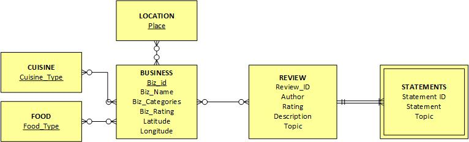

# Proposal

## Background
The project was inspired from a common problem working class adults in Singapore's Central Business District (CBD) faced - where and what to eat for lunch. Daily, the working crowd in CBD look forward to their meal times to recharge and perhaps to catch up with fellow colleagues. However, given the numerous food choices and a lack of time to research on where and what to eat, most people have difficulty deciding their meals. Some have resorted to generating random places to eat using Microsoft Excel. This project aims to suggest places to eat through a chatbot, in order to provide an interactive user experience and to enable the user to make a more informed choice. The chatbot will be built using Natural Language Processing (NLP) techniques.

## Motivation
Chatbots, through Natural Language Processing (NLP), is an attractive method of human-computer interaction due to the interactivity as compared to traditional mediums such as a Frequently Asked Questions (FAQ) section on a website. It has been used in a variety of domains such as environment and sustainable development [1], education [2] and other commercial purposes [3]. The fact that chatbots are not widely used in Singapore for food and restaurants recommendations makes it an obvious primary choice for us to develop one which is specific to Singapore. Furthermore, creating relevant and appropriate response leveraging on various NLP techniques is a tough but critical component to a successful chatbot. Hence, we decided to take on the challenge of developing one. There are also several use cases or scenarios which we think will be immediately useful. They are: 

* Tying up with business to provide exposure as well as a source of revenue (e.g. incentives/discounts). 
* Letting users to have a quick and easy access to information about food places in their vicinity.
* Letting users can subscribe to this service to receive information about trending restaurants based on their preferences communicated to the chatbot
* Providing some entertainment (localized humour) when choosing where to eat.
* Providing other information about food location by complementing current data with other data sources such as Google visitor information (e.g. Popular time, live visits, duration).
* Generating revenue through advertisements within App.

## Analytics Tasks (considered analysis?)
Here we describe the analytics tasks involved in building the chatbot. The chatbot primarily deals with information extraction and document retrieval. Depending on the quality of the topics discovered within the reviews, we aim to also incorporate topic analysis in the development of the chatbot. Each of the task is elaborated below. 

**Information Extraction** - The objective of this task is to make sense of the input provided by the user. Part-of-speech tagging and detecting entities such as foods, locations and cuisines are part of this task. 

**Document Retrieval** - In formulating the response, the chatbot will perform document retrieval from the database to get the list of restaurants most relevant to the user's input. The chatbot will also provide additional information such as a statement from a review to the user to help them make their choice. The database contains a list of known restaurants, and their respective reviews. 

**Topic Analysis** - We aim to discover themes in reviews and use that information to further make the response more relevant and to aid the document retrieval task. The topic most probable as determined by the words in the user's input will serve as filter to filter reviews on the topic. The second filter will be to select a statement from the filtered reviews based on distance measures such as cosine similarity and Jaccard. 

## Approach (Brij)
* Get the data (APIs and scraping)
* Prepare the corpus
* Prepare statement / response pairs?
* Use part of speech tags to understand?
* Use state machines to model the states
* Use information retrieval to get responses
* Use comparison model: cosine similarity to return relevant dictionary
* Use generic grammar rules to construct responses

## About the Data

This section describe the data set that we will be using for the project, including a high level overview of how the data is retrieved and preprocessed. It also contains key statistics about the data. 

**Data Retrieval** - Data used to construct the knowledge database and the train the chatbot will be retrieved from Yelp. The list of businesses within specific locations will be retrieved using REST APIs. The information for the businesses include the name, categories (such as food, cuisine and location) and the rating of the business. 
 
Based on the list of businesses retrieved, web scraping will be done using python to retrieve the reviews as Yelp does not offer any REST APIs for reviews text. 

**Data Preprocessing** - Based on the businesses' information and reviews the following database tables will be created. The processing done to arrive at the tables are described below. 

 Table | Preprocessing Done 
 --- | --- 
businesses | Data retrieved from the REST APIs (in JSON) are formatted and stored in this table. 
cuisines | Yelps's categories consists of foods (eg. Noodles), places (eg. Bars, Bakeries), and cuisines (eg. French, Japanese). Preprocessing was done using a mapping table to tag the categories as cuisines and store them in this table.  
foods | Yelps's categories consists of foods (eg. Noodles), places (eg. Bars, Bakeries), and cuisines (eg. French, Japanese). Preprocessing was done using a mapping table to tag the categories as food and store them in this table.  
places | Yelps's categories consists of foods (eg. Noodles), places (eg. Bars, Bakeries), and cuisines (eg. French, Japanese). Preprocessing was done using a mapping table to tag the categories as places and store them in this table.  
reviews | Web scraping was done to retrieve the reviews, author, published date and rating from Yelp's website. Data retrieved are in text (HTML) and are processed to be stored in this table. 
stmts | Using NLTK's sentence tokenizer, each review is processed into sentences and stored in this table. 

#### Data Set Summary

A summary of the data set is provided below. 

Locations used to query Yelp: City Hall, Raffles Place, Bras Basah, Dhoby Ghaut

The number of records for each entity is provided below:

Businesses | Reviews | Statements | Cuisines | Foods | Places
--- | --- | --- | --- | --- | ---
2590 | 17235 | 171906 | 1740 | 1088 | 985

#### Database Diagram

## Evaluation of Chatbot's Performance
While typical measures such as precision, recall and f-score are useful in evaluating the quality of classifiers 
where data can be split into training and test sets, evaluating the quality of a chatbot can be challenging. The 
Turing Test, used by the Loebner Prize is one measure where if the chatbot's responses cannot be distinguished from a human, it may be considered a good chatbot. 
 
For the purpose of this project, we propose using a manually constructed list of 100 inputs consisting of greetings, questions and random comments be used to solicit responses from the chatbot. The responses will then be interpreted by a human with scores of 0,0.5 and 1. 1 indicates a suitable response, 0.5 indicates a response that might be related and 0 indicates a unrelated response. We aim to maximize the score of the chatbot given these 100 inputs for this project. 

## References
[1] AluxBot - A Chatbot that Encourages the Care for the Environment. (2016). International Journal of Computer Science Issues, 13(6), 120-123.

[2] Yi Fei Wang, & Stephen Petrina. (2013). Using Learning Analytics to Understand the Design of an Intelligent Language Tutor – Chatbot Lucy. International Journal of Advanced Computer Science and Applications, 4(11), 124-131.

[3] Chatbots Raise Questions About the Future of Customer Service. (2016, April 27). PR Newswire, p. PR Newswire, Apr 27, 2016.

